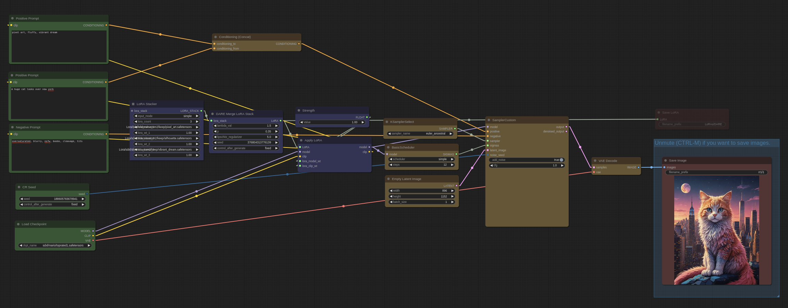

# ComfyUI - Apply LoRA Stacker with DARE

Base image (SDXL):

Adding pixel_art, fluffy and vibrant dream with additive:

Adding pixel_art, fluffy and vibrant dream with DARE (this repo):

## Overview

An experiment about combining multiple LoRAs with DARE [https://arxiv.org/pdf/2311.03099.pdf](https://arxiv.org/pdf/2311.03099.pdf)

## Features

* Merge LoRA Stacks
* Save LoRA
* Experimental lipschitz regularizer (set -1 to turn off)

## Usage

See this workflow for an example [assets/dare_lora.json](assets/dare_lora.json)

For example applicable LoRAs, see [https://civitai.com/user/ntc/models](https://civitai.com/user/ntc/models) or [https://huggingface.co/ntc-ai](https://huggingface.co/ntc-ai)

## Feedback & Contributions

Open a ticket or message me on civit / huggingfaces / patreon / here.

Support me on patreon [https://www.patreon.com/NTCAI](https://www.patreon.com/NTCAI) and get access to hundreds of SDXL LoRAs (~8 mb each) that this technique works great on.
